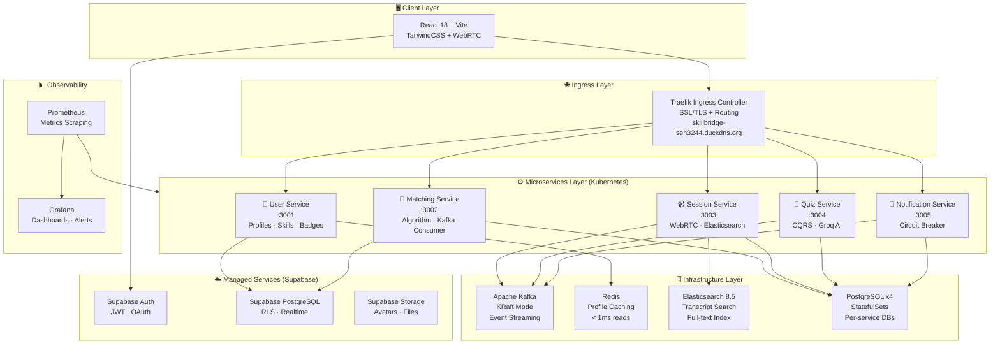
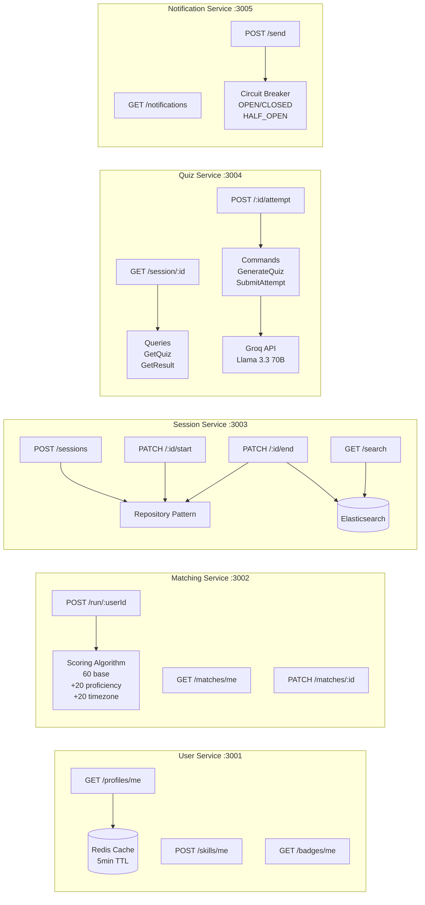
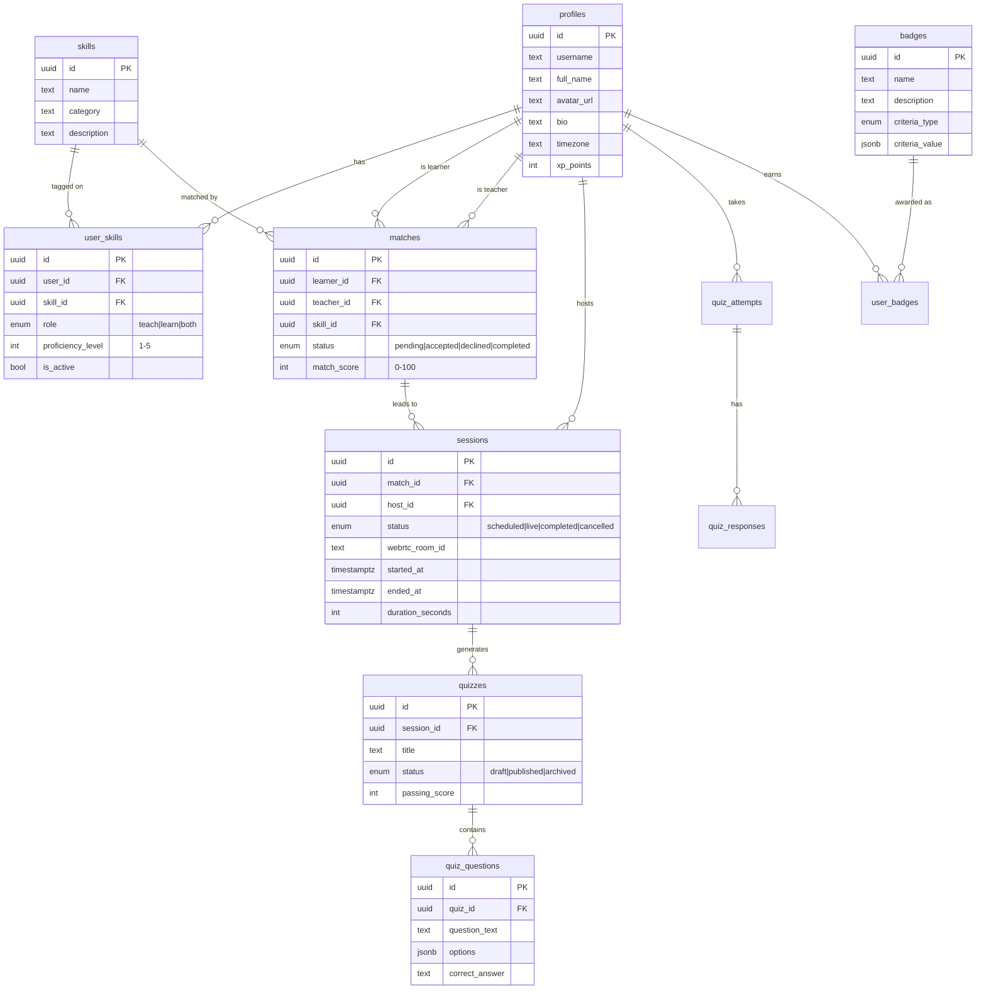
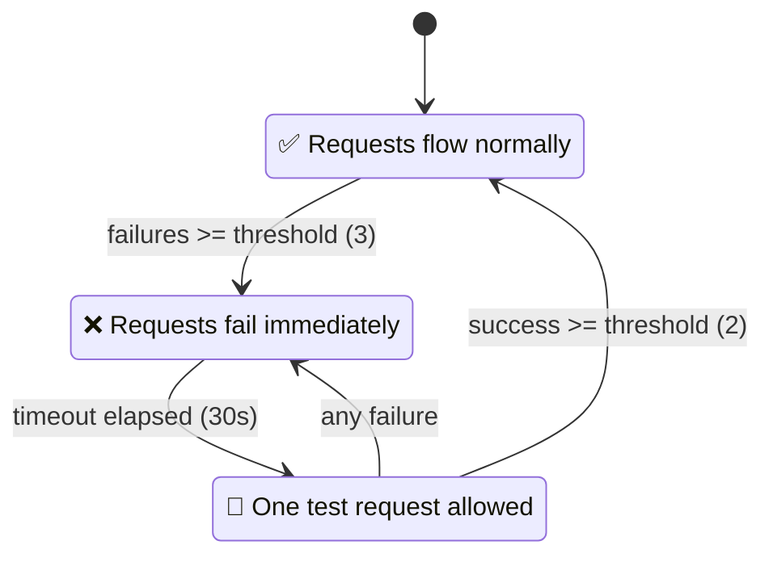
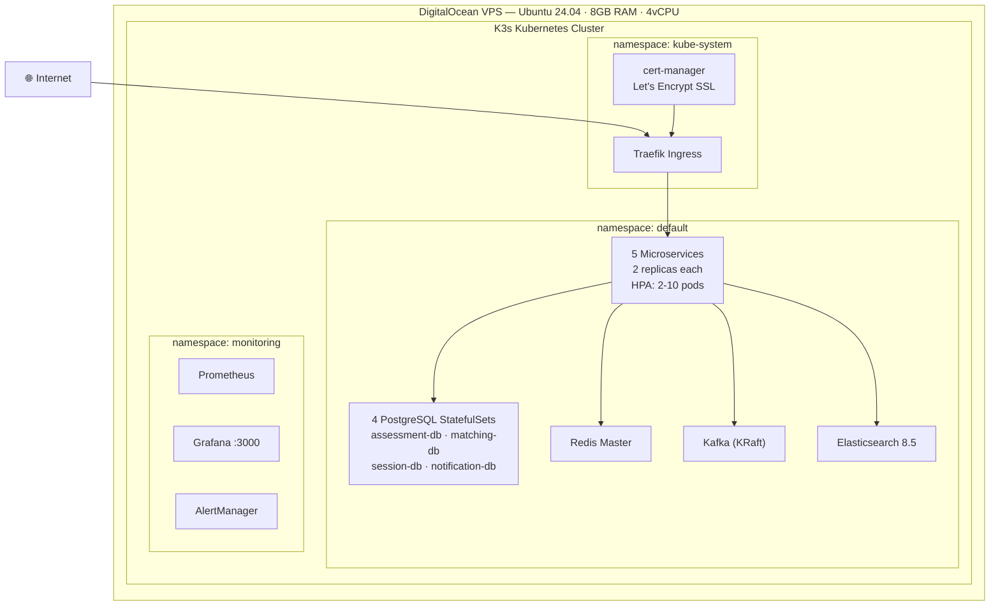
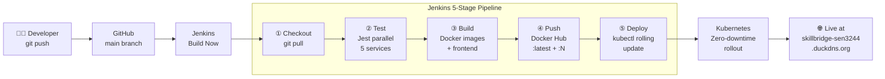

<div align="center">


```
╔═══════════════════════════════════════════════════════════════╗
║                                                               ║
║   ███████╗██╗  ██╗██╗██╗     ██╗     ██████╗ ██████╗ ██╗    ║
║   ██╔════╝██║ ██╔╝██║██║     ██║     ██╔══██╗██╔══██╗██║    ║
║   ███████╗█████╔╝ ██║██║     ██║     ██████╔╝██████╔╝██║    ║
║   ╚════██║██╔═██╗ ██║██║     ██║     ██╔══██╗██╔══██╗██║    ║
║   ███████║██║  ██╗██║███████╗███████╗██████╔╝██║  ██║██║    ║
║   ╚══════╝╚═╝  ╚═╝╚═╝╚══════╝╚══════╝╚═════╝ ╚═╝  ╚═╝╚═╝    ║
║                                                               ║
║          B R I D G E   T H E   K N O W L E D G E   G A P    ║
╚═══════════════════════════════════════════════════════════════╝
```

**A cloud-native peer learning platform where knowledge flows in every direction.**

[](https://react.dev)
[](https://nodejs.org)
[](https://k3s.io)
[](https://supabase.com)
[](https://kafka.apache.org)
[](https://jenkins.io)
[](https://grafana.com)
[](LICENSE)

[🌐 Live Demo](http://skillbridge-sen3244.duckdns.org) · [📚 API Docs](#api-documentation) · [🏗️ Architecture](#architecture) · [🚀 Deploy](#deployment)

</div>

---

## 📖 Table of Contents

- [What is SkillBridge?](#-what-is-skillbridge)
- [The Learning Flow](#-the-learning-flow)
- [Architecture](#-architecture)
- [Microservices](#-microservices)
- [Database Schema](#-database-schema)
- [Design Patterns](#-design-patterns)
- [Infrastructure](#-infrastructure)
- [CI/CD Pipeline](#-cicd-pipeline)
- [Tech Stack](#-tech-stack)
- [Getting Started](#-getting-started)
- [API Documentation](#-api-documentation)
- [Team](#-team)

---

## 🌉 What is SkillBridge?

SkillBridge is a **cloud-native peer-to-peer learning platform** that eliminates the barrier between people who have knowledge and people who need it.

> *"Every expert was once a beginner. Every beginner can become an expert."*

**Core capabilities:**

| Feature | Description |
|---|---|
| 🎯 **Smart Matching** | Algorithm pairs learners with teachers based on skill, proficiency gap, and timezone |
| 📹 **Live Video Sessions** | WebRTC-powered peer-to-peer video calls — no third-party service needed |
| 🤖 **AI-Generated Quizzes** | Groq/Llama 3.3 generates custom MCQs after every session |
| 🏅 **Badge & XP System** | Reputation system rewards teaching and learning milestones |
| 🔍 **Session Search** | Elasticsearch indexes transcripts for full-text search |
| 🔔 **Real-time Notifications** | Supabase Realtime pushes live notifications to the browser |

---

## 🔄 The Learning Flow

```
┌─────────────────────────────────────────────────────────────────────┐
│                        SKILLBRIDGE FLOW                              │
└─────────────────────────────────────────────────────────────────────┘

  👤 USER SIGNS UP          🎯 GETS MATCHED           📹 LIVE SESSION
  ┌─────────────┐          ┌─────────────┐           ┌─────────────┐
  │ • Register  │          │ • Algorithm │           │ • WebRTC    │
  │ • Add skills│  ──────► │   scores    │  ──────►  │   video     │
  │ • Set role  │          │ • Top 5     │           │ • Real-time │
  │   teach/    │          │   matches   │           │   audio     │
  │   learn     │          │   returned  │           └──────┬──────┘
  └─────────────┘          └─────────────┘                  │
                                                             │ session.completed
                                                             ▼ (Kafka event)
  🏅 BADGE AWARDED          📊 QUIZ RESULTS           🤖 AI QUIZ
  ┌─────────────┐          ┌─────────────┐           ┌─────────────┐
  │ • XP +100   │          │ • Score %   │           │ • Groq API  │
  │ • Badge     │  ◄─────  │ • Pass/Fail │  ◄──────  │ • 5 MCQs   │
  │   unlocked  │          │ • Correct   │           │ • Custom to │
  │ • Profile   │          │   answers   │           │   skill     │
  │   updated   │          │   revealed  │           │   taught    │
  └─────────────┘          └─────────────┘           └─────────────┘
```

---

## 🏗️ Architecture

SkillBridge uses a **hybrid microservices architecture** — 5 custom Node.js services backed by Supabase managed services, all running on Kubernetes.



---

## ⚙️ Microservices



---

## 🗄️ Database Schema



---

## 🎨 Design Patterns

### Repository Pattern — Session Service

```
Controller (HTTP layer)
      │
      ▼
SessionRepository (data access layer)
      │
      ├── findById(id)
      ├── findByUserId(userId, status)
      ├── create({ match_id, host_id, scheduled_at })
      ├── updateStatus(id, status, extraFields)
      ├── findAcceptedMatch(matchId)
      └── completeMatch(matchId)
      │
      ▼
Supabase PostgreSQL
```

### CQRS Pattern — Quiz Service

```
HTTP Request
      │
      ├── Write? ──► Commands/
      │               ├── GenerateQuizCommand.js  (AI → DB write)
      │               └── SubmitAttemptCommand.js  (score → DB write)
      │
      └── Read?  ──► Queries/
                      ├── GetQuizQuery.js    (strips correct answers)
                      └── GetResultQuery.js  (shows answers post-attempt)
```

### Circuit Breaker — Notification Service



---

## 🏗️ Infrastructure



### CAP Theorem Strategy

| Service | Strategy | Reason |
|---|---|---|
| Session Service | **CP** | WebRTC room IDs must be consistent |
| Quiz Service | **CP** | Scores must be accurate for badges |
| User Service | **AP** | Slightly stale profiles acceptable |
| Matching Service | **AP** | Old matches OK, availability priority |
| Notification Service | **AP** | Delayed notification > no notification |

---

## 🔄 CI/CD Pipeline



---

## 🛠️ Tech Stack

### Backend
| Technology | Purpose |
|---|---|
| Node.js 20 + Express | All 5 microservices |
| Supabase | Auth, managed PostgreSQL, Realtime, Storage |
| Apache Kafka (KRaft) | Event streaming between services |
| Redis | Profile caching (< 1ms reads) |
| Elasticsearch 8.5 | Session transcript full-text search |
| PostgreSQL x4 | Per-service StatefulSet databases |
| Groq API (Llama 3.3 70B) | AI quiz generation |

### Frontend
| Technology | Purpose |
|---|---|
| React 18 + Vite | SPA framework |
| TailwindCSS v4 | Utility-first styling |
| React Router v7 | Client-side routing |
| Supabase JS | Auth + Realtime subscriptions |
| Axios | API calls with JWT interceptor |
| lucide-react | Icon system |
| WebRTC (native) | Peer-to-peer video sessions |

### Infrastructure
| Technology | Purpose |
|---|---|
| K3s (Kubernetes) | Container orchestration |
| Docker | Containerisation |
| Helm | Package management |
| Traefik | Ingress + SSL termination |
| cert-manager + Let's Encrypt | Automatic SSL certificates |
| Jenkins | CI/CD pipeline |
| Prometheus + Grafana | Metrics + dashboards |
| Ansible | Configuration management (4 playbooks) |
| Terraform | Infrastructure as Code |
| DigitalOcean | Cloud VPS provider |

---

## 🚀 Getting Started

### Prerequisites

```bash
# Required
node >= 20
docker
kubectl
helm

# Optional (for local dev)
k3s or minikube
```

### Clone & Setup

```bash
git clone https://github.com/Asongwelewis/Skill-Bridge.git
cd Skill-Bridge
```

### Environment Variables

Each service needs a `.env` file. Copy from the example:

```bash
cp Services/user-service/.env.example        Services/user-service/.env
cp Services/matching-service/.env.example    Services/matching-service/.env
cp Services/session-service/.env.example     Services/session-service/.env
cp Services/quiz-service/.env.example        Services/quiz-service/.env
cp Services/notification-service/.env.example Services/notification-service/.env
cp frontend/.env.example                     frontend/.env
```

Fill in each `.env`:

```env
SUPABASE_URL=https://your-project.supabase.co
SUPABASE_SECRET_KEY=your_secret_key
KAFKA_BROKER=localhost:9092
GROQ_API_KEY=gsk_your_groq_key         # quiz-service only
ELASTIC_URL=https://localhost:9200      # session-service only
```

### Run Locally

```bash
# Install dependencies for all services
cd Services/user-service && npm install && cd ../..
cd Services/matching-service && npm install && cd ../..
cd Services/session-service && npm install && cd ../..
cd Services/quiz-service && npm install && cd ../..
cd Services/notification-service && npm install && cd ../..
cd frontend && npm install && cd ..

# Run a service
cd Services/user-service && npm run dev    # port 3001
cd Services/matching-service && npm run dev # port 3002
cd Services/session-service && npm run dev  # port 3003
cd Services/quiz-service && npm run dev     # port 3004
cd Services/notification-service && npm run dev # port 3005
cd frontend && npm run dev                  # port 5173
```

### Run Tests

```bash
cd Services/user-service && npm test
cd Services/matching-service && npm test
cd Services/session-service && npm test
cd Services/quiz-service && npm test
cd Services/notification-service && npm test
```

### Deploy to Kubernetes

```bash
# Create secrets
kubectl create secret generic user-service-secret \
  --from-literal=SUPABASE_URL=https://... \
  --from-literal=SUPABASE_SECRET_KEY=...

# Apply all manifests
kubectl apply -f k8s/

# Or trigger Jenkins pipeline
# → http://your-vps:8080 → SkillBridge → Build Now
```

---

## 📚 API Documentation

All services are accessible via the Traefik ingress at `http://skillbridge-sen3244.duckdns.org`

### User Service `/api/users`

| Method | Endpoint | Description |
|---|---|---|
| `GET` | `/profiles/me` | Get my profile |
| `PUT` | `/profiles/me` | Update my profile |
| `GET` | `/profiles/:id` | Get any profile |
| `GET` | `/skills/me` | Get my skills |
| `POST` | `/skills/me` | Add a skill |
| `DELETE` | `/skills/me/:id` | Remove a skill |
| `GET` | `/badges/me` | Get my badges |

### Matching Service `/api/matching`

| Method | Endpoint | Description |
|---|---|---|
| `POST` | `/run/:userId` | Trigger matching algorithm |
| `GET` | `/matches/me` | Get my matches |
| `PATCH` | `/matches/:id` | Accept or decline a match |

### Session Service `/api/sessions`

| Method | Endpoint | Description |
|---|---|---|
| `POST` | `/` | Schedule a session |
| `GET` | `/me` | Get my sessions |
| `PATCH` | `/:id/start` | Go live |
| `PATCH` | `/:id/end` | End session + trigger quiz |
| `GET` | `/search?q=` | Search transcripts |

### Quiz Service `/api/quizzes`

| Method | Endpoint | Description |
|---|---|---|
| `GET` | `/session/:sessionId` | Get quiz for session |
| `POST` | `/:quizId/attempt` | Submit answers |
| `GET` | `/:quizId/result` | Get my result |

### Notification Service `/api/notifications`

| Method | Endpoint | Description |
|---|---|---|
| `GET` | `/` | Get my notifications |
| `PATCH` | `/:id/read` | Mark as read |
| `PATCH` | `/read-all` | Mark all read |
| `GET` | `/circuit-status` | Circuit breaker state |

---

## 👥 Team

| Role | Responsibility |
|---|---|
| **Product Owner / App Lead** | Microservices, Kafka schemas, Supabase schema, React frontend, API docs |
| **Scrum Master / DevOps Lead** | Terraform, Ansible, Jenkins, K8s manifests, Prometheus/Grafana, NGINX |

**Course:** SEN3244 — Software Architecture
**Institution:** ICT University — Faculty of Information and Communication Technologies
**Instructor:** Engr. Tekoh Palma
**Season:** Spring 2026

---

<div align="center">

**Built with ❤️ by the SkillBridge team**

*"The best way to learn is to teach."*

[](http://skillbridge-sen3244.duckdns.org)
[](https://github.com/Asongwelewis/Skill-Bridge)

</div>