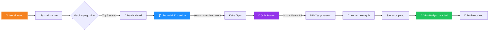
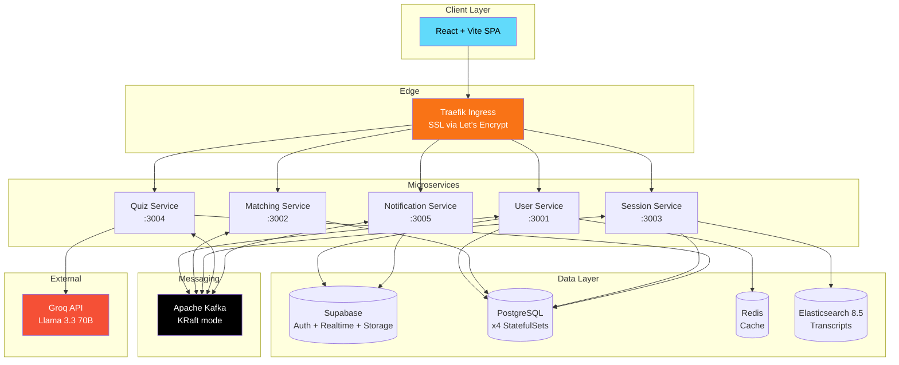

<div align="center">

<!-- Hero banner -->


<br/>

<!-- Animated typing intro -->
[](https://git.io/typing-svg)

<br/>

<!-- Badges -->


<br/>

<!-- Quick links -->
**[🌐 Live Demo](http://skillbridge-sen3244.duckdns.org)** • **[📖 API Docs](#-api-documentation)** • **[🏗 Architecture](#-architecture)** • **[🚀 Deploy](#-getting-started)**

</div>

<br/>

<!-- Demo GIF placeholder -->
<div align="center">

> 📽️ **Demo preview** — drop your GIF here once recorded
>
> 
>
> *Place a `demo.gif` in `/docs/` to replace this placeholder.*

</div>

---

## 📋 Table of Contents

- [💡 What is Skill-Bridge?](#-what-is-skill-bridge)
- [🌟 Features](#-features)
- [🔄 The Learning Flow](#-the-learning-flow)
- [🏗 Architecture](#-architecture)
- [🛠 Tech Stack](#-tech-stack)
- [🚀 Getting Started](#-getting-started)
- [🧪 Running Tests](#-running-tests)
- [☸️ Deploy to Kubernetes](#%EF%B8%8F-deploy-to-kubernetes)
- [📖 API Documentation](#-api-documentation)
- [🗺 Roadmap](#-roadmap)
- [👥 Team](#-team)
- [📄 License](#-license)

---

## 💡 What is Skill-Bridge?

> *"Every expert was once a beginner. Every beginner can become an expert."*

**Skill-Bridge** is a cloud-native, peer-to-peer learning platform that eliminates the barrier between people who *have* knowledge and people who *need* it.

You sign up, list skills you can teach and skills you want to learn, and our matching algorithm pairs you with someone whose strengths fill your gaps. You meet over WebRTC video, the session is recorded and transcribed, and at the end an AI-generated quiz verifies that learning actually happened — awarding XP, reputation badges, and unlocks.

---

## 🌟 Features

<table>
<tr>
<td width="50%" valign="top">

### 🤝 Smart Peer Matching
Skill-gap algorithm scores every potential pair on proficiency delta, skill overlap, and timezone. Returns top 5 matches.

### 📹 Live WebRTC Video
Peer-to-peer video calls. No Zoom, no Twilio, no middleman — your media stream goes browser-to-browser.

### 🧠 AI-Generated Quizzes
After every session, **Groq + Llama 3.3 70B** generates 5 custom MCQs tailored to what was actually taught.

</td>
<td width="50%" valign="top">

### 🏅 Badges & XP
Reputation system rewards both teaching and learning. Climb tiers, unlock badges, build a verifiable skill résumé.

### 🔍 Searchable Transcripts
Every session is transcribed and indexed in **Elasticsearch** for full-text search across your learning history.

### 🔔 Real-time Notifications
**Supabase Realtime** pushes match alerts, session reminders, and quiz results straight to your browser.

</td>
</tr>
</table>

---

## 🔄 The Learning Flow



---

## 🏗 Architecture

Skill-Bridge uses a **hybrid microservices architecture** — 5 custom Node.js services backed by Supabase managed services, all running on K3s (Kubernetes).



### 🎯 CAP Theorem Strategy

| Service | Strategy | Reason |
|---|---|---|
| **Session Service** | CP | WebRTC room IDs must be consistent across replicas |
| **Quiz Service** | CP | Scores must be accurate for badges |
| **User Service** | AP | Slightly stale profiles are acceptable |
| **Matching Service** | AP | Old matches OK — availability priority |
| **Notification Service** | AP | Delayed notification > no notification |

### 🧩 Design Patterns in Play

- **Repository Pattern** → Session Service (clean data-access layer)
- **CQRS** → Quiz Service (separates command writes from query reads)
- **Circuit Breaker** → Notification Service (graceful degradation on failure)

---

## 🛠 Tech Stack

<div align="center">

**Backend & Data**

[](https://skillicons.dev)

**Frontend**

[](https://skillicons.dev)

**Infrastructure**

[](https://skillicons.dev)

</div>

<details>
<summary><b>📋 Full dependency breakdown (click to expand)</b></summary>

### Backend
| Technology | Purpose |
|---|---|
| Node.js 20 + Express | All 5 microservices |
| Supabase | Auth, managed PostgreSQL, Realtime, Storage |
| Apache Kafka (KRaft) | Event streaming between services |
| Redis | Profile caching (< 1ms reads) |
| Elasticsearch 8.5 | Session transcript full-text search |
| PostgreSQL ×4 | Per-service StatefulSet databases |
| Groq API (Llama 3.3 70B) | AI quiz generation |

### Frontend
| Technology | Purpose |
|---|---|
| React 18 + Vite | SPA framework |
| TailwindCSS v4 | Utility-first styling |
| React Router v7 | Client-side routing |
| Supabase JS | Auth + Realtime subscriptions |
| Axios | API calls with JWT interceptor |
| lucide-react | Icon system |
| WebRTC (native) | Peer-to-peer video |

### Infrastructure
| Technology | Purpose |
|---|---|
| K3s (Kubernetes) | Container orchestration |
| Docker | Containerisation |
| Helm | Package management |
| Traefik | Ingress + SSL termination |
| cert-manager + Let's Encrypt | Automatic SSL |
| Jenkins | CI/CD pipeline |
| Prometheus + Grafana | Metrics + dashboards |
| Ansible | Configuration management |
| Terraform | Infrastructure as Code |
| DigitalOcean | Cloud VPS provider |

</details>

---

## 🚀 Getting Started

### Prerequisites

```bash
node >= 20
docker
kubectl
helm
# optional: k3s or minikube for local dev
```

### Clone & Setup

```bash
git clone https://github.com/Asongwelewis/Skill-Bridge.git
cd Skill-Bridge
```

### Environment Variables

Each service needs a `.env`. Copy from the examples:

```bash
cp Services/user-service/.env.example         Services/user-service/.env
cp Services/matching-service/.env.example     Services/matching-service/.env
cp Services/session-service/.env.example      Services/session-service/.env
cp Services/quiz-service/.env.example         Services/quiz-service/.env
cp Services/notification-service/.env.example Services/notification-service/.env
cp frontend/.env.example                      frontend/.env
```

Fill them in:

```env
SUPABASE_URL=https://your-project.supabase.co
SUPABASE_SECRET_KEY=your_secret_key
KAFKA_BROKER=localhost:9092
GROQ_API_KEY=gsk_your_groq_key        # quiz-service only
ELASTIC_URL=https://localhost:9200    # session-service only
```

### Run Locally

```bash
# Install deps for every service
for s in user-service matching-service session-service quiz-service notification-service; do
  (cd Services/$s && npm install)
done
(cd frontend && npm install)

# Start each service in its own terminal
cd Services/user-service          && npm run dev   # → :3001
cd Services/matching-service      && npm run dev   # → :3002
cd Services/session-service       && npm run dev   # → :3003
cd Services/quiz-service          && npm run dev   # → :3004
cd Services/notification-service  && npm run dev   # → :3005
cd frontend                       && npm run dev   # → :5173
```

---

## 🧪 Running Tests

```bash
cd Services/user-service && npm test
cd Services/matching-service && npm test
cd Services/session-service && npm test
cd Services/quiz-service && npm test
cd Services/notification-service && npm test
```

---

## ☸️ Deploy to Kubernetes

```bash
# Create secrets
kubectl create secret generic user-service-secret \
  --from-literal=SUPABASE_URL=https://... \
  --from-literal=SUPABASE_SECRET_KEY=...

# Apply all manifests
kubectl apply -f k8s/

# Or trigger Jenkins pipeline
#   → http://your-vps:8080 → Skill-Bridge → Build Now
```

---

## 📖 API Documentation

All services route through Traefik at `http://skillbridge-sen3244.duckdns.org`.

<details>
<summary><b>👤 User Service — <code>/api/users</code></b></summary>

| Method | Endpoint | Description |
|---|---|---|
| `GET` | `/profiles/me` | Get my profile |
| `PUT` | `/profiles/me` | Update my profile |
| `GET` | `/profiles/:id` | Get any profile |
| `GET` | `/skills/me` | Get my skills |
| `POST` | `/skills/me` | Add a skill |
| `DELETE` | `/skills/me/:id` | Remove a skill |
| `GET` | `/badges/me` | Get my badges |

</details>

Implementation note: `POST /api/users/skills/me` now accepts either `skill_id` or `skill_name` plus `category` so the frontend can create and attach a skill in one flow. The session search route must remain above `/:id` in `Services/session-service/src/routes/sessions.js`.

<details>
<summary><b>🎯 Matching Service — <code>/api/matching</code></b></summary>

| Method | Endpoint | Description |
|---|---|---|
| `POST` | `/run/:userId` | Trigger matching algorithm |
| `GET` | `/matches/me` | Get my matches |
| `PATCH` | `/matches/:id` | Accept or decline |

</details>

<details>
<summary><b>📹 Session Service — <code>/api/sessions</code></b></summary>

| Method | Endpoint | Description |
|---|---|---|
| `POST` | `/` | Schedule a session |
| `GET` | `/me` | Get my sessions |
| `PATCH` | `/:id/start` | Go live |
| `PATCH` | `/:id/end` | End session + trigger quiz |
| `GET` | `/search?q=` | Full-text transcript search |

</details>

<details>
<summary><b>🧠 Quiz Service — <code>/api/quizzes</code></b></summary>

| Method | Endpoint | Description |
|---|---|---|
| `GET` | `/session/:sessionId` | Get quiz for session |
| `POST` | `/:quizId/attempt` | Submit answers |
| `GET` | `/:quizId/result` | Get my result |

</details>

<details>
<summary><b>🔔 Notification Service — <code>/api/notifications</code></b></summary>

| Method | Endpoint | Description |
|---|---|---|
| `GET` | `/` | Get my notifications |
| `PATCH` | `/:id/read` | Mark as read |
| `PATCH` | `/read-all` | Mark all read |
| `GET` | `/circuit-status` | Circuit breaker state |

</details>

---

## 🗺 Roadmap

- [x] 5-microservice MVP with Kafka events
- [x] WebRTC peer-to-peer video
- [x] AI quiz generation (Groq + Llama 3.3)
- [x] Elasticsearch transcript search
- [x] K3s deployment + Jenkins CI/CD
- [ ] Mobile app (React Native)
- [ ] Group sessions (3+ participants)
- [ ] Skill certifications & verified portfolios
- [ ] Multilingual quiz generation (FR + Pidgin)

---

## 👥 Team

| Role | Responsibility |
|---|---|
| **Product Owner / App Lead** | Microservices, Kafka schemas, Supabase schema, React frontend, API docs |
| **Scrum Master / DevOps Lead** | Terraform, Ansible, Jenkins, K8s manifests, Prometheus/Grafana, NGINX |

**Course:** SEN3244 — Software Architecture
**Institution:** ICT University — Faculty of Information & Communication Technologies
**Instructor:** Engr. Tekoh Palma
**Season:** Spring 2026

---

## 📄 License

MIT — see [LICENSE](LICENSE)

---

<div align="center">


**Built with ❤️ in Yaoundé 🇨🇲**

*"The best way to learn is to teach."*

</div>
