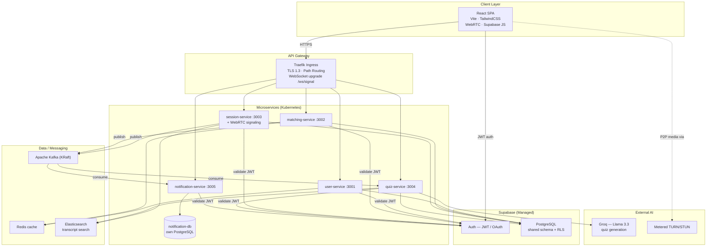
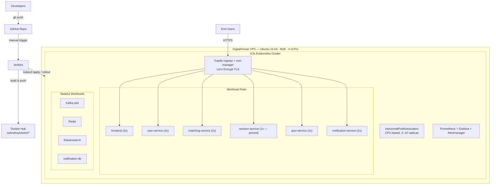
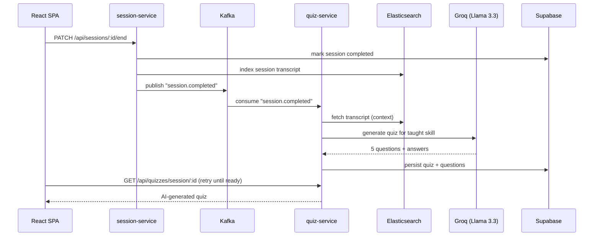

# SkillBridge — System Architecture Document

**Course:** SEN3244 — Software Architecture · ICT University
**Project:** SkillBridge — Cloud-Native Peer Learning Platform
**Version:** 1.0 (as-built)

---

## 1. Introduction & Overview

SkillBridge is a cloud-native peer-learning platform that lets users exchange skills directly with one another. A user lists skills they can **teach** and skills they want to **learn**; a matching algorithm pairs complementary users; matched peers meet in a **live browser-based video session**; and when a session ends, an **AI model automatically generates a quiz** from the taught skill, awarding experience points and badges on success.

**The problem it solves.** Informal peer learning is valuable but unstructured — there is no reliable way to (a) find a partner with complementary skills, (b) meet them live without installing software, and (c) verify that learning actually occurred. SkillBridge addresses all three: AI-assisted matching, in-browser WebRTC video with live chat, and AI-generated post-session assessment.

This document describes the architecture **as actually implemented**, including the pragmatic trade-offs made under project constraints. Where the design deviates from a textbook ideal, this is stated explicitly rather than hidden.

---

## 2. Architecture Style & Justification

### 2.1 Chosen style: Event-Driven Microservices

SkillBridge is built as **five independent microservices** that communicate **asynchronously through an Apache Kafka event bus**, fronted by a single API gateway (Traefik ingress) and a React single-page application.

| Service | Port | Responsibility |
|---|---|---|
| user-service | 3001 | Profiles, skills catalog, user skills, badges; Redis caching |
| matching-service | 3002 | Skill-pairing algorithm, match scoring |
| session-service | 3003 | Session lifecycle, WebRTC signaling, transcript indexing |
| quiz-service | 3004 | AI quiz generation (CQRS), scoring, attempts |
| notification-service | 3005 | Notifications, Circuit Breaker, owns its own database |

### 2.2 Why this style

- **Independent deployability** — each service is its own Docker image, tested, built, and rolled out independently by the CI/CD pipeline.
- **Independent scalability** — stateless services scale horizontally via Kubernetes Horizontal Pod Autoscalers without scaling the whole system.
- **Fault isolation** — a failure in one service (e.g. notification email outage) does not cascade; the Circuit Breaker pattern contains it.
- **Asynchronous decoupling** — services do not call each other's databases or block on synchronous chains. Instead they publish and consume Kafka events, so a slow or temporarily-down consumer never blocks the producer.

### 2.3 Honest characterization: a hybrid architecture

The system is **not** a textbook "pure" microservices deployment, and this document is explicit about that:

- **Most services share a managed PostgreSQL database** (Supabase). user, matching, session, and quiz services read and write a shared schema of 11+ tables. This is the *shared-database* integration pattern.
- **notification-service owns a dedicated PostgreSQL database** (`notification-db`, accessed via a raw `pg` connection pool), genuinely following *database-per-service*.
- **Authentication is delegated entirely to Supabase Auth** (JWT/OAuth), which every service validates.

**Why the shared database?** The core domain entities are tightly related by referential integrity — `matches` reference `profiles` and `skills`; `sessions` reference `matches`; `quizzes` reference `sessions`. Enforcing these relationships with real foreign keys across separate databases is impossible; it would push integrity into fragile application code. A shared, managed Postgres with Row-Level Security (RLS) gives transactional integrity, built-in auth, and operational simplicity for a small team under deadline. The cost is tighter data coupling between services — accepted knowingly. Crucially, the **runtime coupling remains loose**: services still communicate via Kafka events, never by reaching into each other's logic. The notification-service demonstrates the stricter database-per-service pattern where coupling is low enough to allow it.

---

## 3. Component View

The React SPA talks only to the Traefik ingress (over HTTPS) and to Supabase Auth (for login). Traefik routes by path (`/api/users`, `/api/matching`, `/api/sessions`, `/api/quizzes`, `/api/notifications`) and additionally upgrades the WebSocket path `/ws/signal` to the session-service for WebRTC signaling. WebRTC media flows **peer-to-peer** between browsers (via STUN/TURN), never through the server.

---

## 4. Deployment View

**Notes.** All services run with 2 replicas for availability and rolling updates, **except session-service which is pinned to 1 replica** (see §9 — in-memory WebRTC rooms). The HPA provides CPU-based autoscaling for the stateless services. cert-manager automatically provisions and renews Let's Encrypt certificates for the `skillbridge-sen3244.duckdns.org` domain.

**CI/CD pipeline (Jenkins).** The `Jenkinsfile` defines stages: **Checkout → Test (5 services in parallel) → Build (Docker images incl. frontend) → Push (Docker Hub) → Deploy (kubectl rolling update)**. A failure in any test stage halts the pipeline before deployment.

---

## 5. Module / Data View

### 5.1 Shared Supabase schema (used by user, matching, session, quiz)

| Table | Primary writer | Read by |
|---|---|---|
| profiles | user-service (+ auth trigger) | all |
| skills | user-service | all |
| user_skills | user-service | matching |
| matches | matching-service | session, frontend |
| sessions | session-service | quiz, frontend |
| session_messages | session-service (signaling) | frontend |
| quizzes | quiz-service | frontend |
| quiz_questions | quiz-service | frontend |
| quiz_attempts | quiz-service | frontend |
| quiz_responses | quiz-service | frontend |
| badges / user_badges | quiz-service / user-service | all |

Foreign keys enforce integrity across these tables (e.g. `matches.skill_id → skills.id`, `sessions.match_id → matches.id`, `quizzes.session_id → sessions.id`). **Row-Level Security** policies protect rows at the database level; backend services use the Supabase **service-role key**, which intentionally bypasses RLS for trusted server-side operations, while the browser uses the publishable/anon key bound by RLS.

### 5.2 notification-service — dedicated database

notification-service connects to its own PostgreSQL instance (`notification-db`) via a raw `pg` connection pool, isolated from the shared schema — a genuine database-per-service boundary.

---

## 6. Event Flows

### 6.1 Session-completion → AI quiz generation (the core async pipeline)

### 6.2 Skill update → matching

When a user adds a skill, the frontend calls `matchingApi.runMatching(userId)`. The matching-service computes candidate pairs (complementary teach/learn skills), scores them (base + proficiency-gap + timezone overlap), and persists matches. Matching results are cached in Redis.

---

## 7. Design Patterns (verified in code)

| Pattern | Service | Location | Purpose |
|---|---|---|---|
| **Repository** | session-service | `src/repositories/SessionRepository.js` | Encapsulates session data access behind a clean interface, decoupling controllers from the persistence layer. |
| **CQRS** | quiz-service | `src/commands/` (GenerateQuiz, SubmitAttempt) + `src/queries/` (GetQuiz, GetResult) | Separates write operations (generate quiz, submit attempt) from read operations (fetch quiz, fetch result), allowing each path to be optimized independently — notably, the read path strips correct answers for security. |
| **Circuit Breaker** | notification-service | `src/patterns/CircuitBreaker.js` | Prevents repeated calls to a failing downstream (e.g. email provider); opens after a failure threshold, fails fast, and recovers automatically. |
| **Cache-Aside** | user-service | `src/cache/redisClient.js` | Profiles are cached in Redis; reads check the cache first (cache-miss logged), and writes invalidate the cached entry. |

---

## 8. Quality Attributes & Trade-offs

**Scalability.** Stateless services (user, matching, quiz, notification) scale horizontally via HPA based on CPU. WebRTC media is peer-to-peer, so video traffic does **not** scale with server resources — a major scalability win. The exception is session-service signaling (§9).

**Availability.** Two replicas per stateless service, Kubernetes self-healing (crashed pods are recreated automatically), rolling updates for zero-downtime deploys, and health/readiness probes.

**Security.** All traffic over HTTPS (TLS 1.3, auto-renewed). Authentication centralized in Supabase (JWT/OAuth); every service validates tokens. RLS protects data at the row level; the browser is bound by RLS while servers use the service-role key. Known cleanup item: secrets handled during development should be rotated before public release.

**Performance.** Redis cache-aside reduces database load on hot reads (profiles, match scores). Elasticsearch provides fast full-text search over session transcripts. Async Kafka processing keeps user-facing requests fast — quiz generation happens in the background rather than blocking the session-end response.

**CAP positioning.** The shared Supabase Postgres favors **Consistency and Partition-tolerance (CP)** for core transactional data (a match or session is strongly consistent). The Kafka event layer is **eventually consistent (AP-leaning)** — a quiz appears a second or two after a session ends, which is acceptable and is smoothed over in the UI with a retry/loading state.

---

## 9. WebRTC Architecture

Live video is **real peer-to-peer WebRTC**, not a server-relayed stream.

- **Signaling.** A WebSocket server (`Services/session-service/src/signaling.js`, built on the `ws` library) is attached to the same HTTP server as the Express API. It authenticates each connection with the Supabase token, groups peers into rooms keyed by session id (capped at 2), and relays SDP offers/answers and ICE candidates. The second peer to join initiates the offer. It also relays and persists in-session chat messages to the `session_messages` table.
- **NAT traversal.** Google STUN handles direct connections; **Metered TURN servers** (UDP/TCP on 80/443 plus TLS `turns:443`) relay media when peers sit behind restrictive/symmetric NATs (e.g. mobile data ↔ Wi-Fi), which makes cross-network calls work.
- **Known constraint & production fix.** Rooms are held in the signaling server's **in-memory map**, so both peers must connect to the *same pod*. session-service is therefore **pinned to 1 replica**; if it scaled out, peers could land on different pods with split-brain rooms. The documented production fix is a **Redis pub/sub backplane** so any pod can relay to a peer on any other pod — restoring full horizontal autoscaling. Redis is already deployed for this purpose.

---

## 10. Pros, Cons & Future Work

### Pros of the chosen architecture
- Independent build/test/deploy/scale per service.
- Strong fault isolation; async event flow prevents cascading failures.
- Peer-to-peer video offloads media cost from the server.
- Managed auth + RLS reduces security surface and development effort.

### Cons / accepted trade-offs
- Shared database couples most services at the data layer (not pure microservices).
- Single-pod signaling limits session-service horizontal scaling (mitigated, fix documented).
- Kafka runs as a single ephemeral pod (no persistence) — fine for transient events, not production-durable.

### Future work
- **Redis pub/sub signaling backplane** → restore session-service autoscaling.
- **Group sessions** via an SFU (e.g. mediasoup/Janus) for >2 participants.
- **Full database-per-service** for the remaining services, with event-sourced replication of reference data.
- **Durable Kafka** as a StatefulSet with persistent volumes.
- **Short-lived TURN credentials** via Metered's REST API instead of static keys.

---

*This document reflects the system as built and deployed for the SEN3244 final examination. Diagrams are written in Mermaid and render on GitHub or at mermaid.live.*
